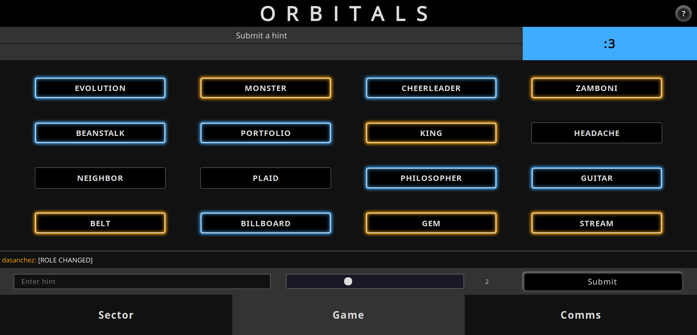
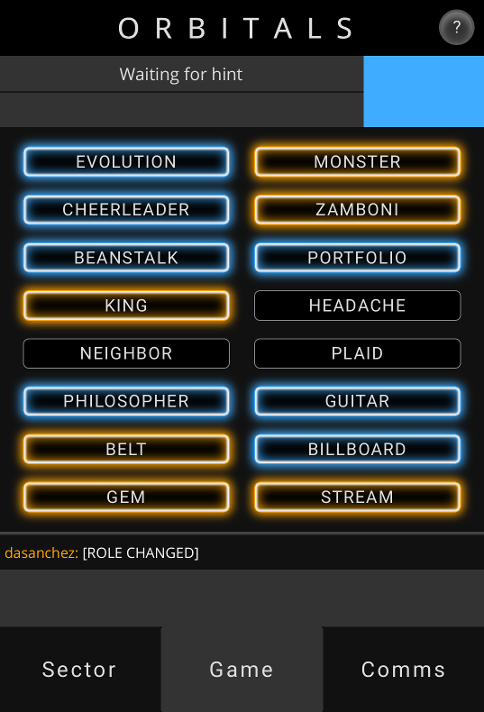

# orbitals-client

### Web client for the Orbitals game

Try a live demo at [urra.ca](https://urra.ca/orbitals/)!

## Usage

This website is built with vanilla Javascript.

Run an instance of [orbitals-server](https://github.com/dasanchez/orbitals-server) and connect to it through this client using the appropriate websocket port (the default one is 9001).

## Screenshots

Desktop

Mobile

